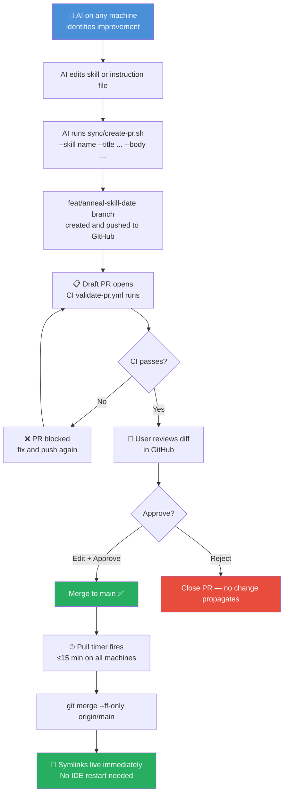
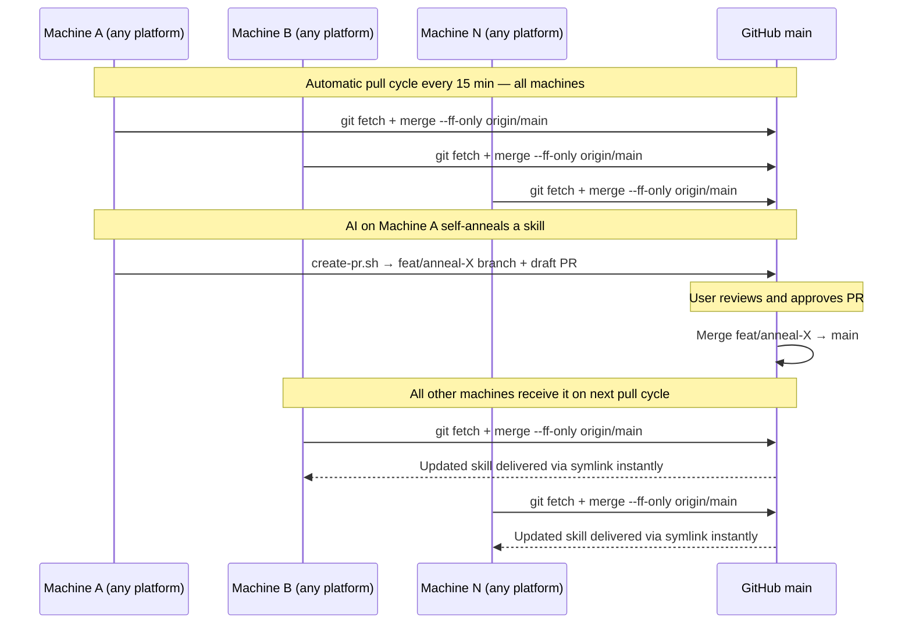
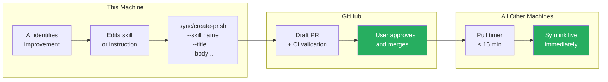
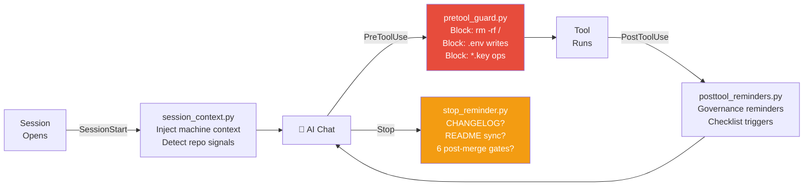
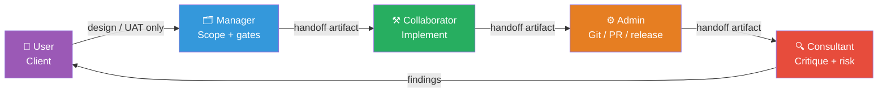

<div align="center">

# 🧠 copilot-governance

**Platform-agnostic AI governance — any AI coding platform, any machine, any number of users**

[](https://github.com/chf3198/copilot-governance/actions/workflows/validate-pr.yml)
[](LICENSE)
[](https://agentskills.io)
[](https://github.com/chf3198/copilot-governance)
[](CONTRIBUTING.md)

[Quick Install](#-quick-install) · [How It Works](#-how-it-works) · [Self-Annealing](#-self-annealing) · [Skills Library](#-skills-library) · [Contributing](#-contributing)

</div>

---

## What This Is

Every AI coding session on every machine should follow the same high-quality protocols — the same engineering standards, the same GitHub workflow, the same security guards. This repo is that shared governance layer.

It installs in one command, self-updates every 15 minutes, and lets any machine's AI propose an improvement that — after your review — propagates everywhere. The architecture places **no limit on platforms, machines, or users**: any AI platform that reads a rules file and loads skills from a directory can be wired in with one `install.sh` stanza and a template file.

```
┌──────────────────────────────────────────────────────────────────────────┐
│                     ~/copilot-governance  (this repo)                    │
│                                                                          │
│  instructions/   skills/   agents/   hooks/   sync/                     │
└───────┬──────────────┬──────────────┬────────────────┬───────────────────┘
        │              │              │                │
        ▼              ▼              ▼                ▼
  ~/.copilot/    ~/.gemini/      ~/.claude/       ~/.yourplatform/
  (VS Code)   (Antigravity)   (Claude Code)     (any future platform)
  symlink       symlink +       symlink +         one stanza in
                @-imports       @-imports         install.sh
```

One repo. One `git pull`. All platforms live.

---

## 🚀 Quick Install

**Any platform — one command:**

```bash
curl -fsSL https://raw.githubusercontent.com/chf3198/copilot-governance/main/install.sh | bash
```

**One-time per machine — authenticate the GitHub CLI so the AI can propose PRs:**

```bash
gh auth login
```

That's it. The pull timer installs itself and runs every 15 minutes in the background.

<details>
<summary>What the installer does (click to expand)</summary>

1. Clones the repo to `~/copilot-governance` (skips if already present)
2. Symlinks `~/.copilot/ → ~/copilot-governance/` and merges VS Code `settings.json`
3. Generates `~/.gemini/GEMINI.md` (Antigravity rules) from the template with your actual path
4. Symlinks `~/.gemini/antigravity/skills/ → ~/copilot-governance/skills/`
5. Generates `~/.claude/CLAUDE.md` (Claude Code instructions) from the template
6. Symlinks `~/.claude/skills/ → ~/copilot-governance/skills/`
7. Installs and enables the systemd user pull timer (`governance-pull.timer`)
8. Runs `loginctl enable-linger` so the timer survives logout

All steps are idempotent — safe to re-run any time.

</details>

---

## 🏗 How It Works

### Platform Support

The architecture is **platform-agnostic**. Any AI coding platform that supports file-based config can be wired in by adding one stanza to `install.sh`, a `${REPO_DIR}` template rules file, and a skills directory symlink. No skill files change — the [agentskills.io](https://agentskills.io) `SKILL.md` format is an open standard any platform can implement.

**Currently wired platforms:**

| Platform | Config Root | Skills | Rules / Instructions | Hooks |
|---|---|---|---|---|
| **VS Code Copilot** | `~/.copilot/` → repo symlink | `~/.copilot/skills/` | `~/.copilot/instructions/*.instructions.md` | `hooks/global-standards.json` |
| **Google Antigravity** | `~/.gemini/` | `~/.gemini/antigravity/skills/` → symlink | `~/.gemini/GEMINI.md` with `@`-imports | *(not yet documented)* |
| **Claude Code** | `~/.claude/` | `~/.claude/skills/` → symlink | `~/.claude/CLAUDE.md` with `@`-imports | `~/.claude/settings.json` hooks |
| **Any platform** | `~/.yourplatform/` | symlink → `skills/` | template rules file via `envsubst` | platform-specific |

**Adding a new platform:** create `YOURPLATFORM.md` template, add an `install.sh` stanza that runs `envsubst` and creates the skills symlink, open a PR. Skill files require zero changes.

### Repository Layout

```
copilot-governance/
├── install.sh                    ← one-command bootstrap, all platforms
├── GEMINI.md                     ← Antigravity rules template (${REPO_DIR} placeholder)
├── CLAUDE.md                     ← Claude Code instructions template
│
├── instructions/                 ← 8 always-on rules injected every session
│   ├── global-standards.instructions.md
│   ├── github-governance.instructions.md
│   ├── operator-identity-context.instructions.md
│   ├── role-baton-routing.instructions.md
│   ├── repo-health-onboarding.instructions.md
│   ├── release-docs-hygiene.instructions.md
│   ├── workflow-resilience.instructions.md
│   └── playwright-mcp-low-resource.instructions.md
│
├── skills/                       ← 25 on-demand expert skills (agentskills.io format)
│   ├── github-ops-excellence/
│   ├── github-ticket-lifecycle-orchestrator/
│   ├── workflow-self-anneal/
│   └── ...
│
├── agents/                       ← 4 specialized agents
│   ├── governance-auditor.agent.md
│   ├── release-reviewer.agent.md
│   ├── security-scanner.agent.md
│   └── planner.agent.md
│
├── hooks/                        ← lifecycle enforcement (VS Code Copilot)
│   ├── global-standards.json
│   └── scripts/
│       ├── session_context.py    ← SessionStart: inject machine context
│       ├── pretool_guard.py      ← PreToolUse: block dangerous ops
│       ├── posttool_reminders.py ← PostToolUse: governance reminders
│       └── stop_reminder.py      ← Stop: post-merge gate check
│
├── sync/                         ← sync automation
│   ├── pull.sh                   ← pulls from main (run by systemd timer)
│   ├── create-pr.sh              ← creates a draft PR for a self-annealed improvement
│   ├── governance-pull.service
│   └── governance-pull.timer
│
└── .github/
    └── workflows/
        └── validate-pr.yml       ← CI: validates SKILL.md + no secrets on every PR
```

---

## 🔄 Sync Architecture

### The PR-Based Approval Flow

The pull timer and GitHub PRs together create a zero-conflict, user-approved sync loop:



### Multi-Machine Sequence



### Why Conflicts Cannot Occur

Machines **never push directly to `main`**. Every change flows through a named PR that the user approves. The pull timer only does `--ff-only` — a local clone either fast-forwards cleanly or surfaces a warning for manual triage. There is no push daemon, no auto-merge bot, no race condition.

---

## ✨ Self-Annealing

Self-annealing is the system's ability to improve its own global-items. When an AI session discovers a better protocol — a more precise skill, a tighter guard, a clearer instruction — it proposes the change formally through a PR.



**Invoking it manually:**

```bash
bash ~/copilot-governance/sync/create-pr.sh \
  --skill workflow-self-anneal \
  --title "Tighten pre-merge gate for missing CHANGELOG entries" \
  --body "Root cause: check wasn't catching omissions for patch releases.
Change: added patch-release condition to gate logic.
Evidence: 3 recent merges passed without CHANGELOG entries."
```

**The user is the approval gate.** Nothing reaches other machines without an explicit merge.

---

## 📚 Skills Library

Skills are on-demand expert procedures. All 25 follow the [agentskills.io](https://agentskills.io) open standard — the same `SKILL.md` file works on every supported platform without modification. Adding a platform does not require changing any skill.

**Invoke any skill by name:**
```
invoke `github-ticket-lifecycle-orchestrator` skill
invoke `workflow-self-anneal` skill with context: post-failure
invoke `release-version-integrity` skill
```

### GitHub Operations

| Skill | Purpose |
|---|---|
| `github-ops-excellence` | Expert GitHub policy profiles and control catalogs |
| `github-ops-tree-router` | Routes GitHub requests through a capability-first skill tree |
| `github-ticket-lifecycle-orchestrator` | End-to-end ticket: create → branch → PR → merge → closeout |
| `github-review-merge-admin` | Review gates, required checks, merge queue readiness |
| `github-ruleset-architecture` | Repository and org ruleset design and audit |
| `github-actions-security-hardening` | Least-privilege tokens, pinned actions, supply-chain controls |
| `github-capability-resolver` | Resolves feature availability by plan and repo settings |
| `github-projects-agile-linkage` | Agile linkage in GitHub Projects — issue types, automations |
| `github-release-incident-flow` | Release readiness, rollback evidence, hotfix linkage |

### Repository Health

| Skill | Purpose |
|---|---|
| `repo-onboarding-standards` | Onboard any repo into Copilot + CI governance baseline |
| `repo-profile-governance` | Audit community health, metadata, contribution surfaces |
| `repo-standards-router` | Classify repo by app type → correct standards branch |
| `repo-structure-conventions` | File organization, naming conventions, project layouts |
| `docs-drift-maintenance` | Detect and remediate documentation drift after code changes |
| `release-version-integrity` | Validate release metadata across tags, manifests, changelogs |
| `secret-exposure-prevention` | Prevent secret leakage in git history, artifacts, logs, docs |

### Role Execution

| Skill | Purpose |
|---|---|
| `role-baton-orchestrator` | Orchestrates Manager → Collaborator → Admin → Consultant handoff |
| `role-manager-execution` | Scopes changes, defines acceptance criteria and verification gates |
| `role-collaborator-execution` | Implements scoped changes and produces validation evidence |
| `role-admin-execution` | Git / PR / release ops and runtime controls |
| `role-consultant-critique` | Independent post-execution critique and risk scoring |

### Platform / Environment

| Skill | Purpose |
|---|---|
| `operator-identity-context` | Establishes operator identity and execution mandate |
| `playwright-vision-low-resource` | Low-resource Playwright + Vision profile for constrained machines |
| `mem-watchdog-ops` | Crostini memory watchdog — triage, log interpretation, tuning |
| `workflow-self-anneal` | Bounded self-annealing review of instructions and workflow outcomes |

---

## 🪝 Lifecycle Hooks

Hooks enforce governance automatically at the session level — no invocation needed.



---

## 🎭 Role Execution Model

Non-trivial tasks use a single-thread baton handoff. At most one role is active at a time.



The user is consulted only for design decisions and UAT sign-off. The AI executes all other steps.

---

## 🤝 Contributing

Improvements from any source are welcome. This is a public governance library.

### Adding a New Skill

1. Fork and create a branch: `feat/<issue-number>-<skill-name>`
2. Create `skills/<skill-name>/SKILL.md` following the [agentskills.io](https://agentskills.io) format:

```yaml
---
name: your-skill-name
description: One sentence — what it does and when to use it.
argument-hint: [key parameter hints]
user-invocable: true
disable-model-invocation: false
---

# Your Skill Name

## Purpose
...
```

3. Open a PR — CI validates frontmatter and scans for secrets automatically
4. PR body should include: what the skill does, what problem it solves, evidence of effectiveness

### Conventions

| Item | Convention |
|---|---|
| PR / commit titles | Conventional Commits — `feat(skill): add X` · `fix(instruction): correct Y` |
| Branch naming | `feat/<number>-<slug>` or `fix/<number>-<slug>` |
| Issue titles | Plain imperative ≤72 chars — no `[TAG]` brackets |
| Secrets | Never in repo — CI rejects PRs containing credential patterns |

See [CONTRIBUTING.md](CONTRIBUTING.md) for the full guide.

---

## 🔒 Security

- API keys live per-machine in VS Code's secure credential storage — **never** in repo files
- `pretool_guard.py` blocks all AI operations touching `.env`, `*.pem`, `*.key`, and related files
- CI scans every PR for AWS key patterns, GitHub PATs, OpenAI keys, and Slack tokens
- `.gitignore` blocks common secret file extensions at the repo level

Found a security issue? Please use a [private security advisory](https://github.com/chf3198/copilot-governance/security/advisories/new) rather than a public issue.

---

## 📋 Post-Merge Checklist

After every PR that changes user-facing behavior, the AI gate-checks all six items before marking complete:

| # | Gate | When Required |
|---|---|---|
| 1 | CHANGELOG entry | Every behavioral change |
| 2 | README sync | User-visible behavior changed |
| 3 | `repo-profile-governance` skill | Community health files, metadata |
| 4 | `docs-drift-maintenance` skill | Any code or config change |
| 5 | `docs/workflow/learnings.md` | Significant discovery made |
| 6 | `release-version-integrity` skill | Package or extension behavior changed |

---

## License

[MIT](LICENSE) — use freely, contributions welcome.
